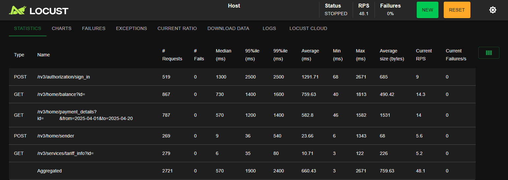

# Bridge_load_test
Нагрузочное тестирование сервера с помощью Locust.

#### Перед запуском тестирования создайте и заполните .env файл согласно env-example.txt.

## Запуск Locust-сервера
### Linux

1. Перейдите в директорию проекта
2. Дайте разрешение на выполнение:
```bash
chmod +x run_locust.sh
```
3. Запустите скрипт:
- обычный режим
```bash
./run_locust.sh
```
- параллельный режим: распределение нагрузки между ядрами процессора (полезен при большом числе генерируемых пользователей)
```bash
./run_locust.sh --divide
```
Теперь сервер должен быть доступен по адресу: http://localhost:8089/

### on Windows
1. Перейдите в директорию проекта
2. Запустите скрипт:
- обычный режим
```bash
run_locust.bat 
```
- параллельный режим
```bash
run_locust.bat --divide
```
Теперь сервер должен быть доступен по адресу: http://localhost:8089/

## Использование Locust
В открывшемся web-интерфейсе заполните поля:
1. total number of users - общее количество пользователей для теста
2. users growth rate - количество новых пользователей в секунду
3. host (заполняется автоматически, проверьте это значение)

#### Теперь вы можете начать тестирование.

## Описание отслеживаемых параметров

1. requests - число отправленных запросов.
2. failes - число запросов, вызвавших ошибку.
3. median - время ответа большинства обработанных запросов меньше, либо равно этому значению. Лучше отображает типичную ситуацию, поскольку экстремальные значения не так сильно влияют на него, как на обычное среднее.
4. 95%ile - максимальное время ответа 95% запросов
5. 99%ile - максимальное время ответа 99% запросов
6. average - обычное среднее арифметическое ВСЕХ времен ответов. 
7. min - минимальное зафиксированное время ответа. 
8. max - максимальное зафиксированное время ответа.
